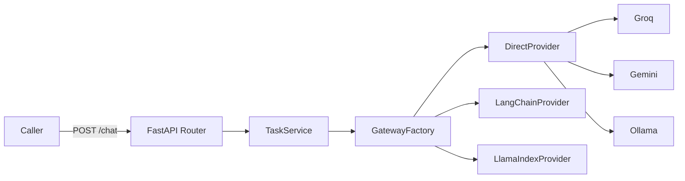

# LLM Provider Gateway

A single FastAPI service that lets application code call an LLM without hardcoding which SDK, framework, or vendor is behind it. A request specifies a provider, a framework, and a task, and the gateway routes it to the right implementation behind one stable API contract.

## Problem

Real applications end up needing more than one way to talk to an LLM: a direct vendor SDK for simple calls, LangChain when chains or tools are needed, LlamaIndex for retrieval-heavy tasks, and often a local model such as Ollama for offline or cost-sensitive work. Wiring each of those into application code separately leads to duplicated logic and vendor lock-in. This gateway centralizes that decision behind one API so callers only need to change a request field, not their integration code.

## Architecture



`GatewayFactory` is a small factory that maps a `Framework` enum value to a concrete `BaseLLMProvider` implementation. Every provider implements the same interface, so `TaskService` and the API layer never need to know which one is actually running.

## Tech Stack

The service is built with FastAPI and Pydantic v2 for request and response validation, with `python-dotenv` for configuration. Provider integrations cover the direct provider SDKs, LangChain, and LlamaIndex, with support for Groq, Gemini, and local Ollama models as backing LLMs.

## How It Works

A caller sends an `LLMRequest` to `POST /chat` containing a provider such as groq, gemini, or ollama, a framework such as direct, langchain, or llamaindex, a task such as chat, summarize, extract-json, or classify, and an input string. `TaskService` reads the framework field and asks `GatewayFactory` for the matching provider implementation, then delegates execution to it. Every provider returns a normalized `LLMResponse` containing the provider, framework, task, model, and output, so the response shape never changes no matter which backend served the request.

## Key Features

The project demonstrates a clean strategy and factory pattern for swapping LLM integration styles at request time, a single typed contract shared across three different backend implementations, and task-oriented prompts such as chat, summarize, extract-json, and classify rather than a single generic completion endpoint.

## API Flow

`GET /health` reports service status and environment for basic liveness checks. `POST /chat` accepts a JSON body matching `LLMRequest`, validates it with Pydantic, resolves the requested framework to a provider through `GatewayFactory`, executes the task through that provider, and returns an `LLMResponse` with the generated output.

## Setup

```bash
git clone https://github.com/yrlmanoharreddy/llm-provider-gateway.git
cd llm-provider-gateway
python -m venv venv
source venv/bin/activate
pip install -r requirements.txt
cp .env.example .env
uvicorn app.main:app --reload
```

Populate `.env` with whichever provider keys you plan to use, such as `GROQ_API_KEY` or `GEMINI_API_KEY`. Ollama only requires a local Ollama server reachable at `OLLAMA_BASE_URL`.

## Testing

There is no automated test suite yet. The `/health` endpoint and the Swagger UI at `/docs` are the current way to manually verify each provider path. Adding `pytest` tests that mock each provider and assert the response contract is the most valuable next step for this repository.

## Deployment

The service runs as a standard Uvicorn and FastAPI application and has no Dockerfile yet. Since it holds no state beyond configuration, it is a good candidate for a minimal container image and a horizontally scaled deployment behind a load balancer.

## Engineering Decisions

The provider and framework split, rather than a single enum, was chosen so the same vendor can be reached through more than one integration style, for example calling Groq directly or calling Groq through LangChain, without changing the API contract. Keeping `LLMResponse` identical across providers was a deliberate constraint so switching providers is a configuration change for API consumers rather than a breaking change.

## Status

The direct, LangChain, and LlamaIndex provider paths are implemented behind the shared interface. The known gaps are the missing automated tests and containerization, both called out above rather than glossed over.
